#HSLIDE

## Git 101 
### (and beyond)

#HSLIDE
## Git 是什麼？

#VSLIDE 
Git 是一個
**分散式** <!-- .element: class="fragment" -->
**版本控制** <!-- .element: class="fragment" -->
工具 <!-- .element: class="fragment" -->

#VSLIDE
#### 版本控制

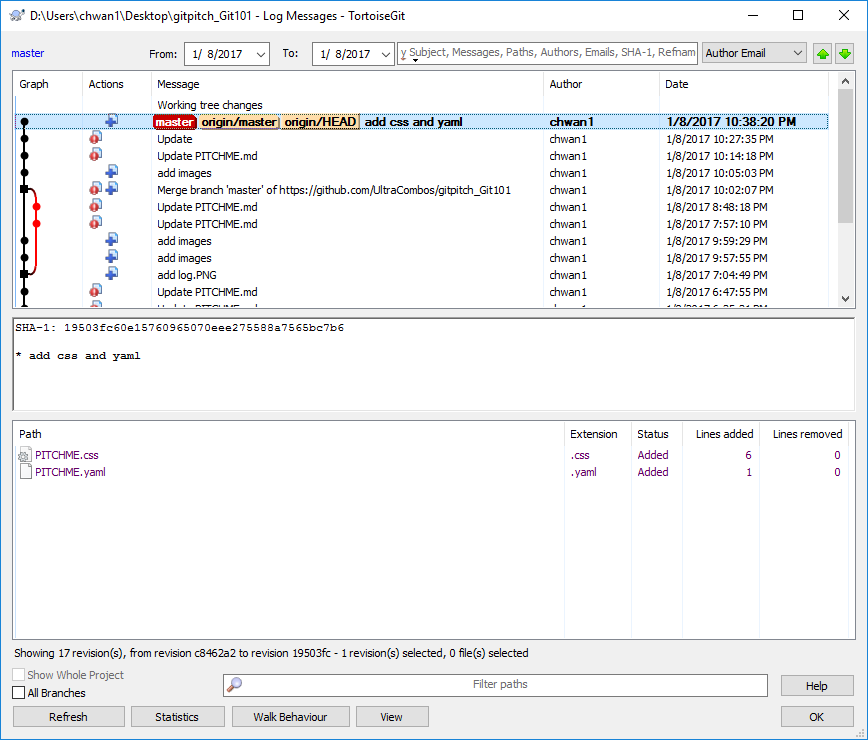

#VSLIDE


#VSLIDE
#### 分散式


#VSLIDE

集中式版本控制長這樣


#HSLIDE
## 基本操作

#VSLIDE
#### 安裝軟體
- [TortoiseGit](https://tortoisegit.org/)
- [Git for Windows](https://git-scm.com/download/win)
- [Git Large File Storage (LFS)](https://git-lfs.github.com/)
<!-- 補充 ```git lfs install``` and ```git lfs track "*.psd"``` -->

#VSLIDE
#### First Pull

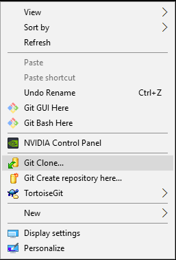
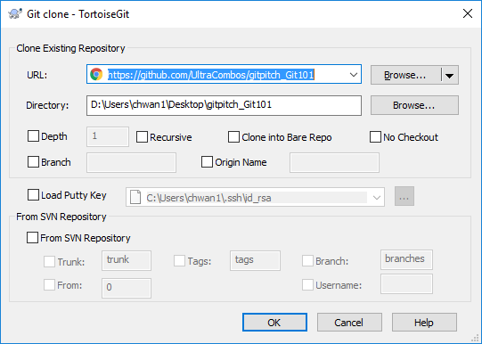

#VSLIDE
#### 設定個人資訊

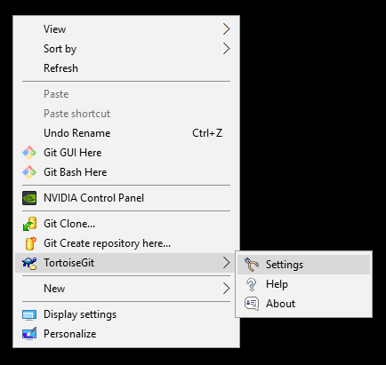

#VSLIDE
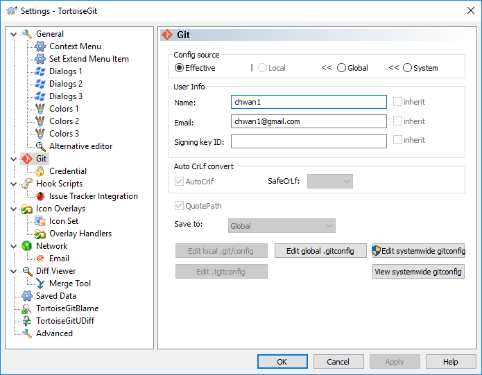

#VSLIDE
#### First commit

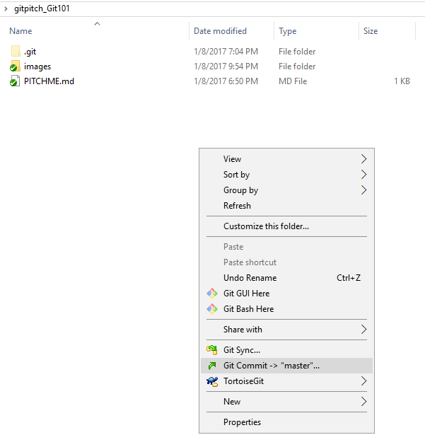

#VSLIDE
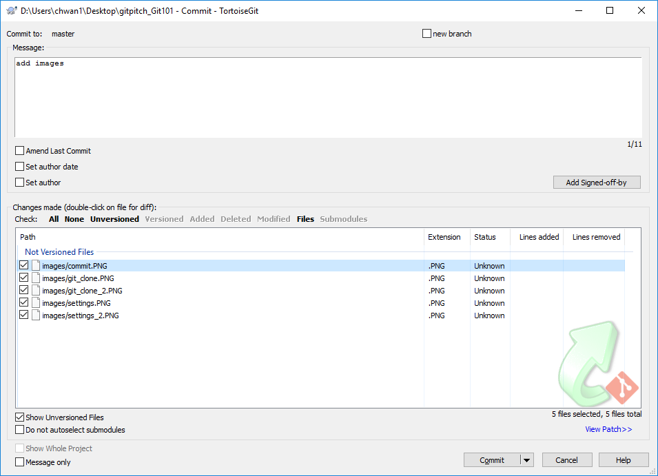

#VSLIDE
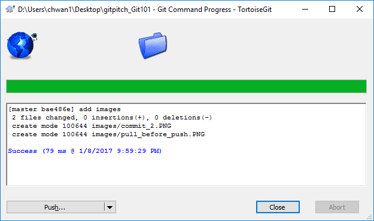

#VSLIDE
#### First Push

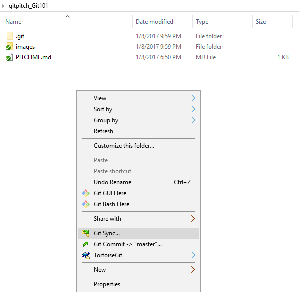

#VSLIDE
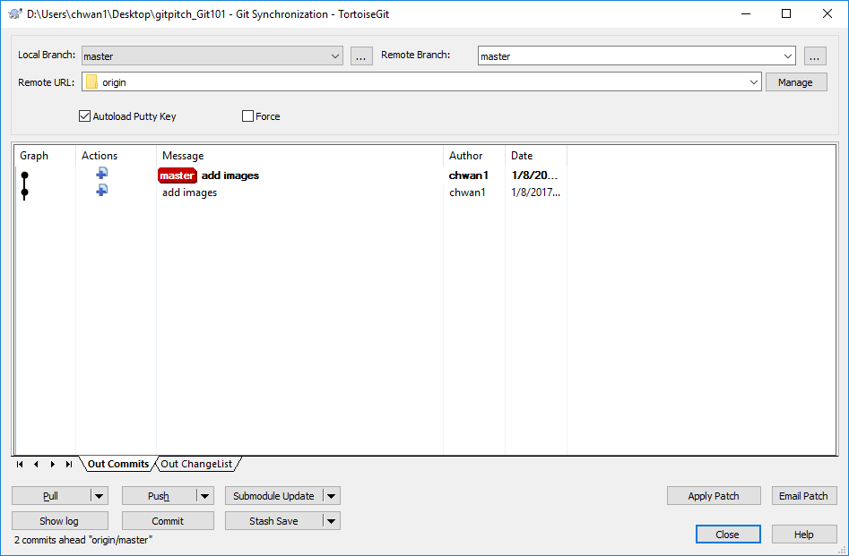

#VSLIDE
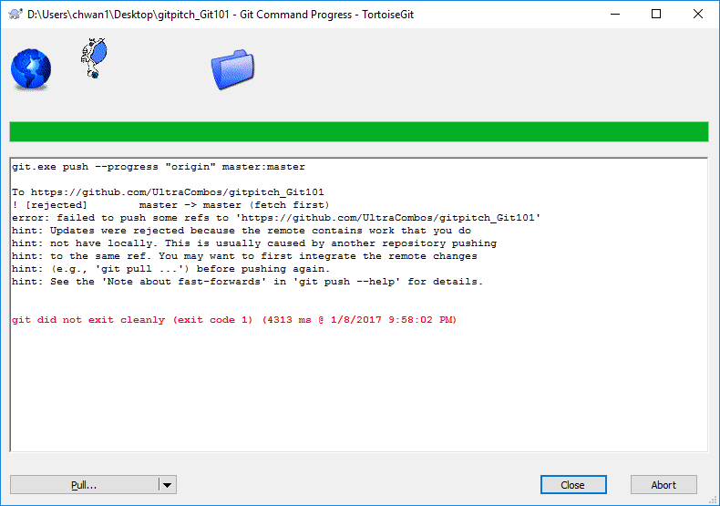

#VSLIDE
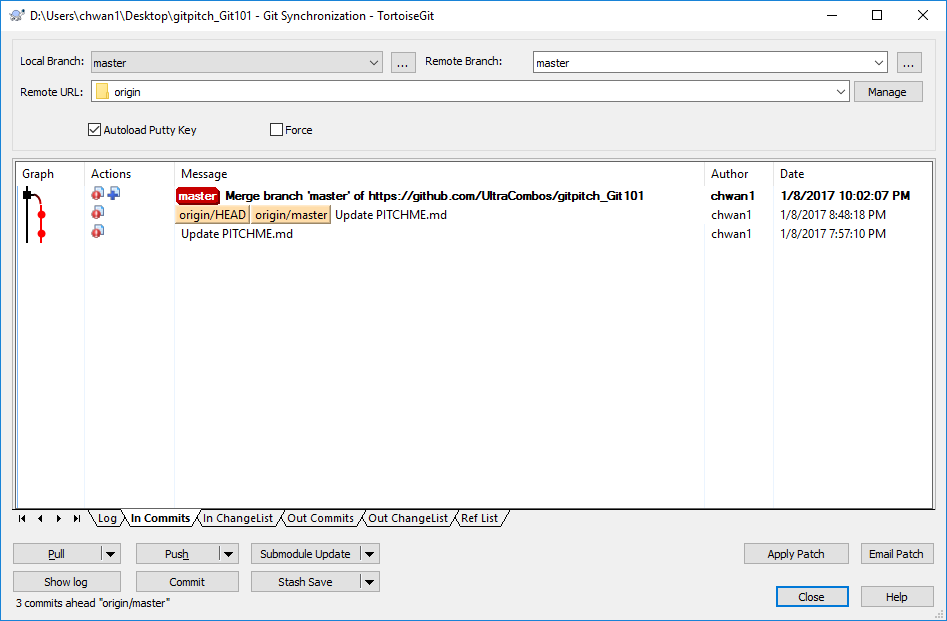

#VSLIDE
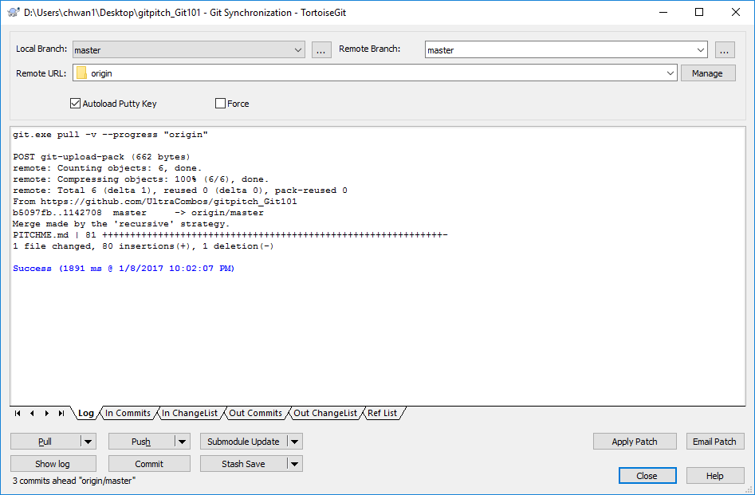

#VSLIDE
#### 還原版本
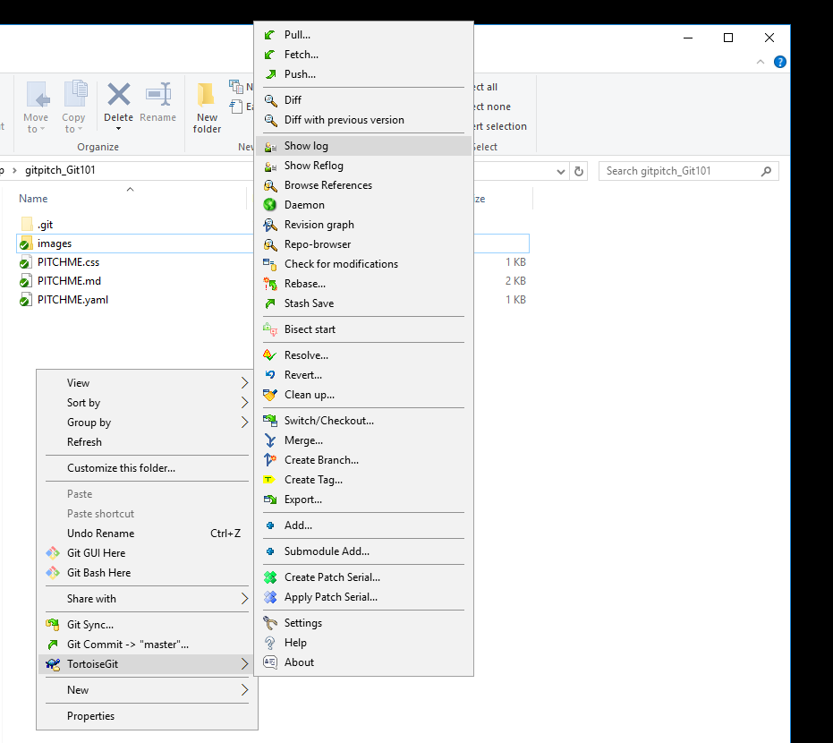

#VSLIDE
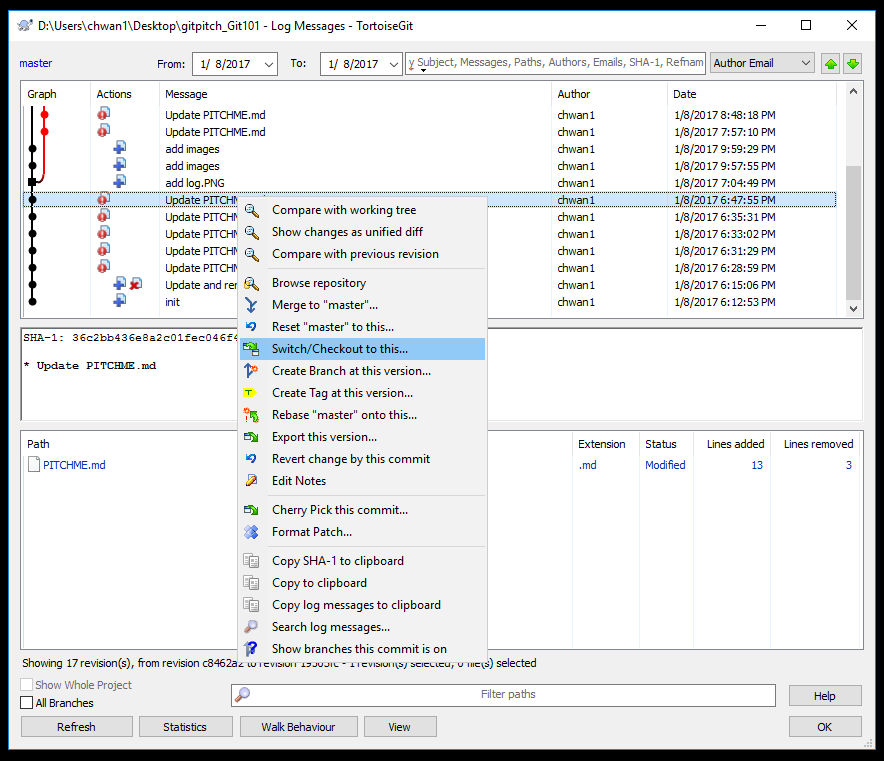

#VSLIDE
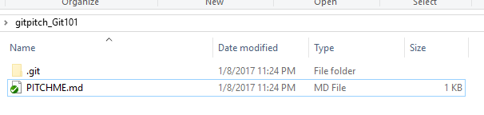

#VSLIDE
#### 還原檔案

#VSLIDE
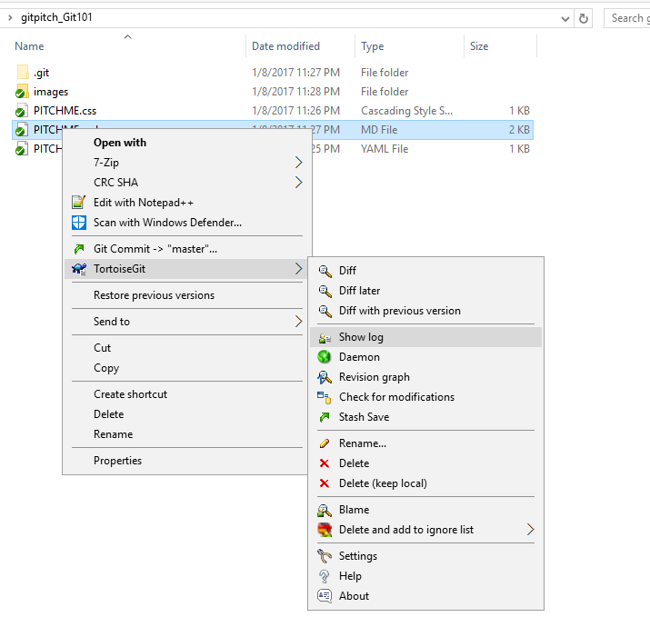

#VSLIDE
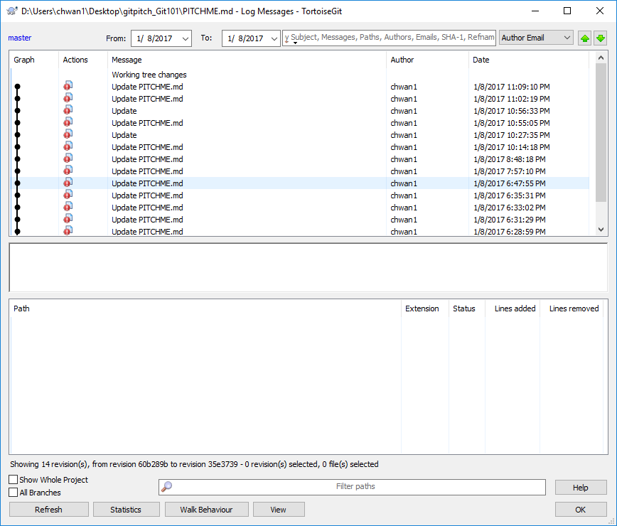

#VSLIDE
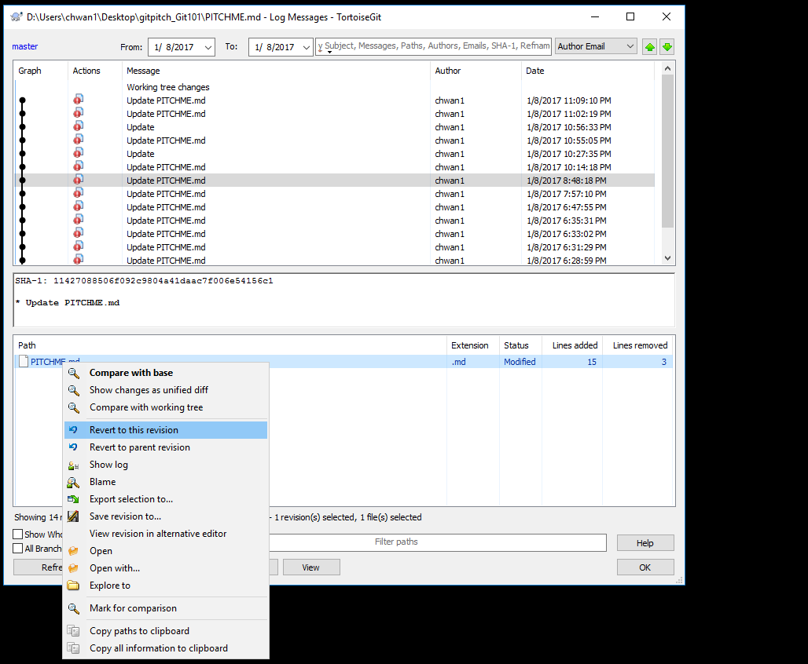

#VSLIDE
#### 在 Github, Gitlab, nas 新增版本庫

#VSLIDE
#### 使用 ignore file

#VSLIDE
#### 使用 tag

#VSLIDE
#### Resolve conflict

#HSLIDE
## 重要概念

#VSLIDE
#### Repository

#VSLIDE
#### Remote


#VSLIDE
#### [Branch](https://git-scm.com/book/zh-tw/v2/Git-%E5%88%86%E6%94%AF-%E5%88%86%E6%94%AF%E7%9A%84%E7%B0%A1%E4%BB%8B) Tag, and HEAD

#VSLIDE
#### Merge

#VSLIDE
#### Fetch

#VSLIDE
#### Check out / Commit

#VSLIDE 
#### Pull / Push

- Pull = Fetch remote + merge remote/master

#HSLIDE
## Reference

#VSLIDE
- [寫給大家的 Git 教學](http://www.slideshare.net/littlebtc/git-5528339)
- [Pro Git](https://git-scm.com/book/zh-tw/v2/)
- [Git 版本控制系統 -- 從微觀到宏觀](http://www.slideshare.net/ihower/git-40877359)
- [Learning Git Branch](http://learngitbranching.js.org/)

